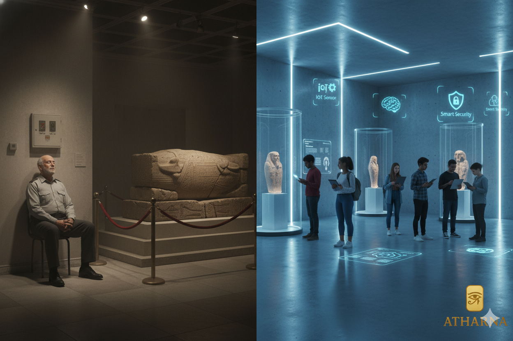
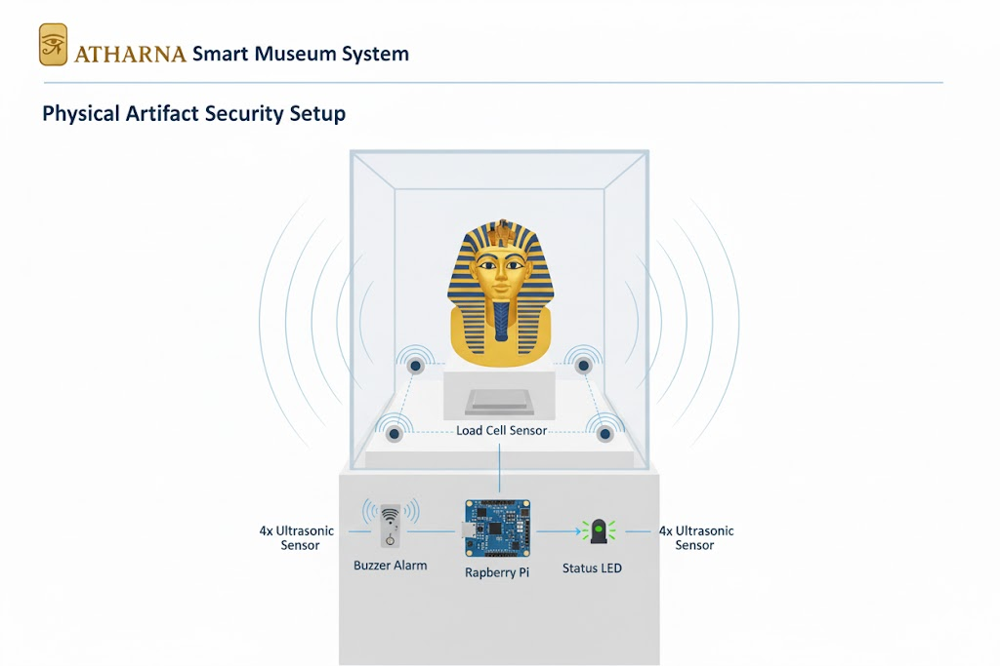
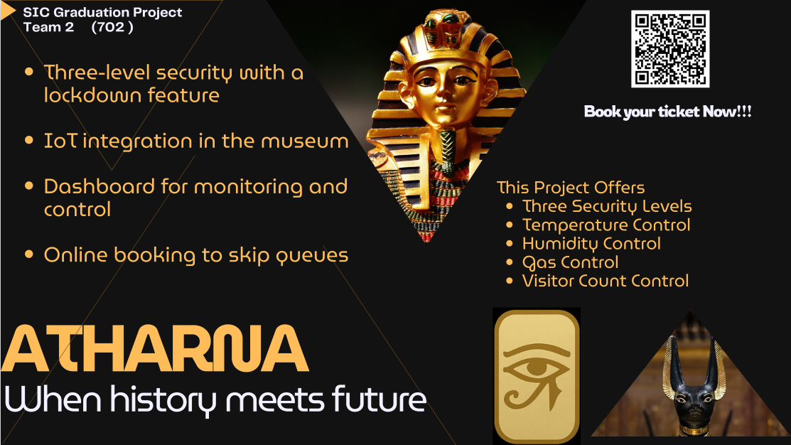

# 🏛️ ATHARNA: Smart Museum Security & Visitor Experience System

## 📌 Overview & Vision

**ATHARNA** is a comprehensive, multi-layered smart museum system developed as a graduation project for the **Samsung Innovation Campus**. The system aims to modernize artifact protection and elevate the visitor experience by seamlessly integrating **Internet of Things (IoT)**, **Computer Vision (OpenCV)**, and a robust mobile application.

### 🎯 The Problem

Traditional museum security systems rely heavily on human supervision and simple alarms, making them prone to human error and delayed response times. These systems often fail to provide instant alerts for environmental risks (like gas or extreme temperatures) or detect unauthorized handling of artifacts in real-time.

### 💡 The ATHARNA Solution

ATHARNA introduces an automated, real-time defense mechanism that includes:

1. **Physical Safety Monitoring:** Immediate detection of any tampering or artifact removal attempts using **Load Cell** and **Ultrasonic sensors**.
    
2. **Environmental Risk Control:** Continuous monitoring of temperature, humidity, and hazardous gas levels using **DHT11** and **MQ2** sensors.
    
3. **Secure Access Control:** Securing access for authorized restoration staff through **Face Detection** authentication.
    
4. **Enhanced Visitor Experience:** A full-featured mobile app for booking, **NFC-based ticket entry**, and interactive artifact information via **QR Code scanning**.




## 🧠 System Architecture & Components

The system is divided into three main layers: **Edge Layer** (Sensors), **Communication Layer** (Protocols), and **Application Layer** (Software).

### 1. ⚙️ Hardware and Edge Layer (Raspberry Pi)

|Component|Functionality|Security Layer|
|---|---|---|
|**Load Cell**|Detects minute changes in weight; triggers an alarm if the artifact is lifted.|Anti-Theft|
|**4x Ultrasonic Sensors**|Creates a virtual barrier around the artifact; alerts upon excessive proximity.|Anti-Tampering|
|**Camera Module + OpenCV**|**Face Detection** for securing access for authorized restoration personnel.|Staff Access Control|
|**NFC Module**|Provides **NFC-based entry for visitors** holding a valid mobile reservation.|Visitor Access|
|**MQ2 Gas Sensor**|Monitors flammable gases/smoke; triggers a physical alarm (**Buzzer**).|Environmental Safety|
|**DHT11 Sensor**|Measures and displays ambient temperature and humidity.|Artifact Preservation|
|**Servo Motor**|Automatic barrier for controlling entry/exit points.|Physical Control|

### 2. 💻 Software and Communication

|Component|Role|Protocol/Technology|
|---|---|---|
|**Python**|Main system logic, sensor reading, and camera execution.|N/A|
|**MQTT (HiveMQ)**|**Communication Protocol** for real-time data transfer between devices and applications.|IoT Protocol|
|**Firebase**|Backend for the Flutter application (Authentication and booking data).|Database & Auth|
|**Flutter (Dart)**|**Mobile Application** for visitors and administration (iOS/Android).|Frontend|
|**Node-RED**|**Web Dashboard** for instant visualization of system status and alerts.|Visualization|
|**OpenCV**|Computer Vision library used for **Face Detection**.|Computer Vision|

## 📱 Mobile Application Features (Flutter)

The application provides a seamless and effective user experience:

|Feature|Description|
|---|---|
|**Multi-Language Support**|Easy switching between Arabic and English interfaces.|
|**Digital Booking System**|Selecting museum, date, time, and group size (max. 10 people).|
|**Reservation Management**|Reviewing current and past reservations with cancellation capability.|
|**QR Code Interaction**|Scanning a QR code next to an artifact to display immediate historical and cultural information.|
|**Notifications & Confirmation**|Instant notifications and booking confirmation via email.|

## 🛠️ Installation & Setup Guide

### 1. Hardware Setup (Raspberry Pi)

1. Clone the repository:
    
    ```
    git clone (https://github.com/RoshdyZarif/ATHARNA)
    cd ATHARNA/hardware
    ```
    
2. Create and activate a Python virtual environment:
    
    ```
    python3 -m venv venv
    source venv/bin/activate
    ```
    
3. Install the required Python libraries:
    
    ```
    pip install -r requirements.txt
    ```
    
4. Run the main program (after confirming physical connections):
    
    ```
    python3 Main.py
    ```


### 2. Mobile App Setup (Flutter)

1. Navigate to the Flutter folder:
    
    ```
    cd ../flutter_app
    ```
    
2. Get dependencies:
    
    ```
    flutter pub get
    ```
    
3. **Note:** Ensure the Firebase project is correctly linked and configuration files are present.
    
4. Run the application:
    
    ```
    flutter run
    ```

You Can Scan this QR Code To Go to WebAPP

## 👥 Team Members

- **Roshdy Zarif**
    
- **Bola Sameh**
    
- **Mohamed Younis**
    
- **William Mounir**

